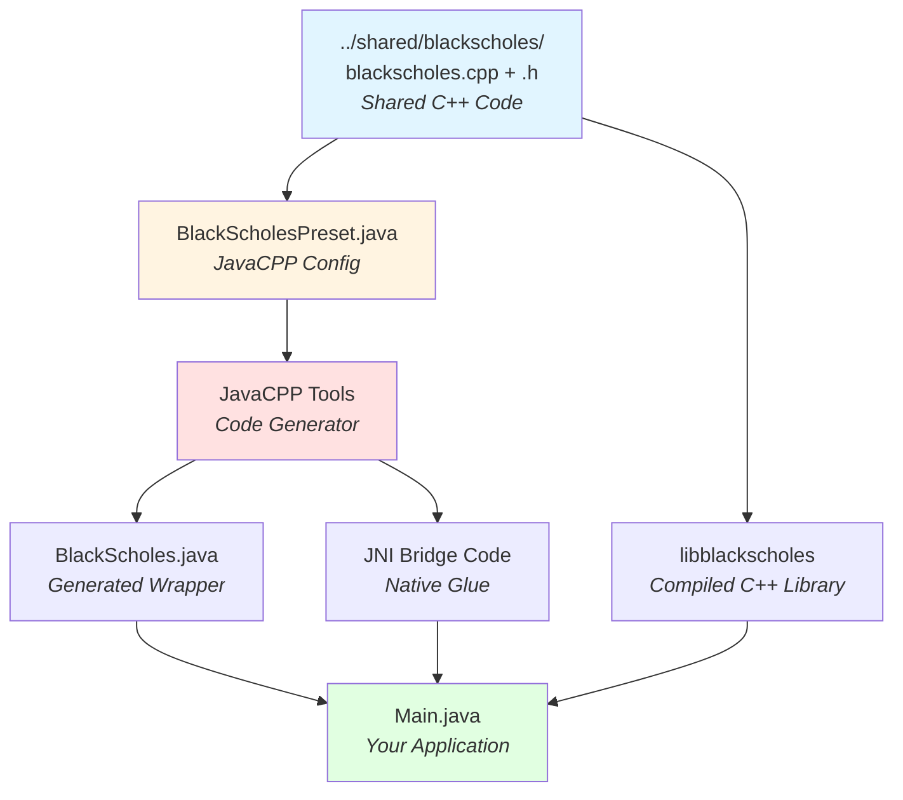

# Black-Scholes JavaCPP Integration (Example 1 of 3)

This example demonstrates how to integrate C++ code with Java using [JavaCPP](https://github.com/bytedeco/javacpp). It wraps a Black-Scholes option pricing implementation in C++ so it can be called from Java code.

## What This Example Shows

- How to use JavaCPP to create Java bindings for C++ functions
- Building and packaging C++ code as a JAR file
- Calling C++ functions from Java with native performance
- Cross-platform builds (Linux, macOS, Windows)

## Learning Path

This is **Part 1 of 3** in the C++ integration examples:
1. **01-blackscholes-javacpp** (this example) - Learn JavaCPP basics
2. [02-blackscholes-pybind11](../02-blackscholes-pybind11/) - Learn pybind11 basics
3. [03-blackscholes-combined](../03-blackscholes-combined/) - See both working together in Deephaven

## About the Implementation

The core Black-Scholes C++ implementation is located in [../shared/blackscholes](../shared/blackscholes/). This example uses JavaCPP to create Java bindings that call the shared C++ code.

**Key Architecture Points:**
- **No local C++ files**: This example has no `src/main/cpp/` directory
- **Shared source**: The build script compiles `../shared/blackscholes/blackscholes.cpp` directly
- **Header parsing**: JavaCPP reads `../shared/blackscholes/blackscholes.h` to generate bindings
- **Preset configuration**: `BlackScholesPreset.java` tells JavaCPP where to find headers
- **Namespace mapping**: C++ `BlackScholes` namespace maps to Java `BlackScholes` class via `@Namespace` annotation

### How JavaCPP Works



The JavaCPP workflow:
1. **Compile C++ code** from shared directory into native library
2. **Create JavaCPP preset** specifying header location and library name
3. **JavaCPP parses headers** and generates Java wrapper classes + JNI code
4. **Compile everything** into a JAR + native library
5. **Use from Java** with natural syntax - JavaCPP handles native calls

## Java Usage Example

The C++ `BlackScholes` namespace functions are accessible as static methods on the `BlackScholes` Java class:

```java
import io.deephaven.BlackScholes;

public class Main {
    public static void main(String[] args) {
        // Calculate call option price
        double s = 100.0;    // Underlying price
        double k = 95.0;     // Strike price  
        double r = 0.05;     // Risk-free rate (5%)
        double t = 0.6;      // Time to expiry (0.6 years)
        double vol = 0.4;    // Volatility (40%)
        
        // Call C++ functions through JavaCPP bindings
        double price = BlackScholes.price(s, k, r, t, vol, true, false);
        double delta = BlackScholes.delta(s, k, r, t, vol, true, false);
        double gamma = BlackScholes.gamma(s, k, r, t, vol, false);
        
        System.out.println("Option Price: " + price);
        System.out.println("Delta: " + delta);
        System.out.println("Gamma: " + gamma);
    }
}
```

**Note:** The C++ `BlackScholes::` namespace functions map directly to Java `BlackScholes.` static methods. No `bs_` prefix is needed!

## Resources

For more details on JavaCPP:
* [JavaCPP GitHub](https://github.com/bytedeco/javacpp)
* [Manual build example](https://github.com/opendiff/java-c-plus-plus)
* [Gradle integration](https://github.com/bytedeco/gradle-javacpp)
* [Template project](https://github.com/illumon-public/JavaCppGradleTemplate/tree/master)

New versions of [./javacpp.jar](./javacpp.jar) can be downloaded from [JavaCPP releases](https://github.com/bytedeco/javacpp/releases).

## Building

To build this example, you will need to have the following installed:
* Java
* A C++ compiler

To build this example, run the following command:
```bash
./build.sh
```

## Running

The build script automatically runs a test at the end. You should see output like:
```
Black-Scholes Price: 16.136...
```

The build creates:
- JAR file: `build/<platform>/blackscholes.jar` (e.g., `build/macosx-arm64/blackscholes.jar`)
- Native library: `build/<platform>/libblackscholes.<ext>` (e.g., `libblackscholes.dylib` on macOS)
- JNI bridge library: `build/<platform>/libjniBlackScholes.<ext>`

To run manually (replace `<platform>` with your platform, e.g., `macosx-arm64`):
```bash
PLATFORM="macosx-arm64"  # or linux-x86_64, etc.
java -Djava.library.path=build/${PLATFORM} -cp build/${PLATFORM}/blackscholes.jar:javacpp.jar org.example.Main
```

## Next Steps

After completing this example, continue to:
- [02-blackscholes-pybind11](../02-blackscholes-pybind11/) - Learn how to wrap C++ for Python
- [03-blackscholes-combined](../03-blackscholes-combined/) - See both integrations in Deephaven

