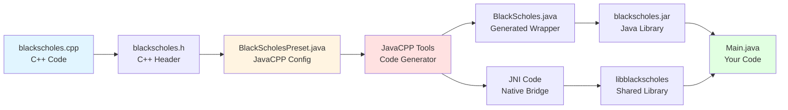

# Black-Scholes JavaCPP Integration (Example 1 of 3)

This example demonstrates how to integrate C++ code with Java using [JavaCPP](https://github.com/bytedeco/javacpp). It wraps a Black-Scholes option pricing implementation in C++ so it can be called from Java code.

## What This Example Shows

- How to use JavaCPP to create Java bindings for C++ functions
- Building and packaging C++ code as a JAR file
- Calling C++ functions from Java with native performance
- Cross-platform builds (Linux, macOS, Windows)

## Learning Path

This is **Part 1 of 3** in the C++ integration examples:
1. **01-blackscholes-javacpp** (this example) - Learn JavaCPP basics
2. [02-blackscholes-pybind11](../02-blackscholes-pybind11/) - Learn pybind11 basics
3. [03-blackscholes-combined](../03-blackscholes-combined/) - See both working together in Deephaven

## About the Implementation

The core Black-Scholes C++ implementation is located in [../shared/blackscholes](../shared/blackscholes/). This example wraps it for use in Java.

### How JavaCPP Works



The JavaCPP workflow:
1. Write C++ code and header file
2. Create a JavaCPP preset (configuration)
3. JavaCPP generates Java wrapper classes and JNI code
4. Compile everything into a JAR + native library
5. Use from Java with natural syntax

## Resources

For more details on JavaCPP:
* [JavaCPP GitHub](https://github.com/bytedeco/javacpp)
* [Manual build example](https://github.com/opendiff/java-c-plus-plus)
* [Gradle integration](https://github.com/bytedeco/gradle-javacpp)
* [Template project](https://github.com/illumon-public/JavaCppGradleTemplate/tree/master)

New versions of [./javacpp.jar](./javacpp.jar) can be downloaded from [JavaCPP releases](https://github.com/bytedeco/javacpp/releases).

## Building

To build this example, you will need to have the following installed:
* Java
* A C++ compiler

To build this example, run the following command:
```bash
./build.sh
```

## Running

The build script automatically runs a test at the end. You should see output like:
```
Black-Scholes Price: 13.270...
```

The build creates:
- JAR file: `build/{platform}/blackscholes.jar`
- Shared libraries: `build/{platform}/lib*.{so|dylib|dll}`

To run manually:
```bash
java -Djava.library.path=${OUTPUT_DIR} -cp ${OUTPUT_DIR}/blackscholes.jar:javacpp.jar org.example.Main
```

## Next Steps

After completing this example, continue to:
- [02-blackscholes-pybind11](../02-blackscholes-pybind11/) - Learn how to wrap C++ for Python
- [03-blackscholes-combined](../03-blackscholes-combined/) - See both integrations in Deephaven

