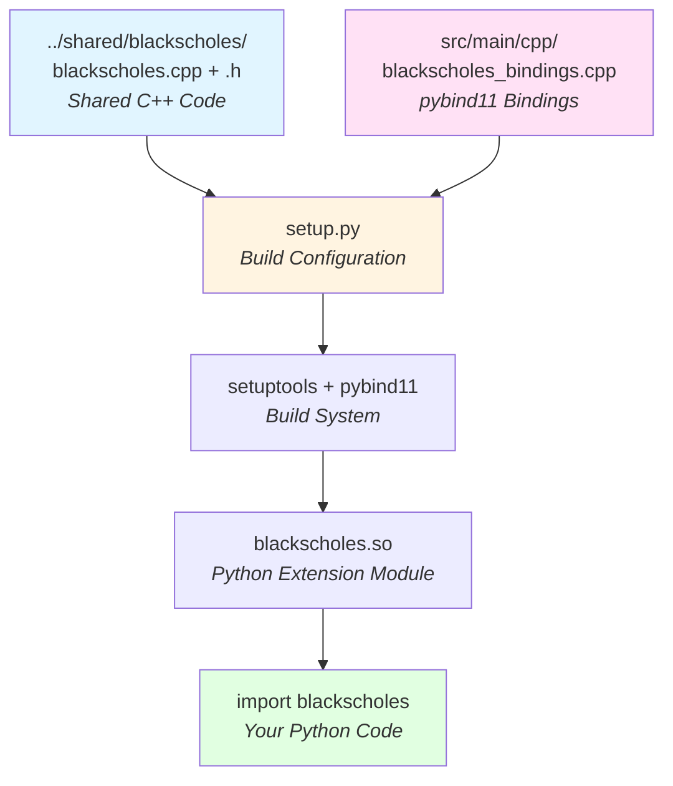

# Black-Scholes pybind11 Integration (Example 2 of 3)

This example demonstrates how to integrate C++ code with Python using [pybind11](https://github.com/pybind/pybind11). It wraps a Black-Scholes option pricing implementation in C++ so it can be called from Python code.

## What This Example Shows

- How to use pybind11 to create Python bindings for C++ functions
- Building Python wheels with C++ extensions
- Calling C++ functions from Python with native performance
- Using setuptools for packaging

## Learning Path

This is **Part 2 of 3** in the C++ integration examples:
1. [01-blackscholes-javacpp](../01-blackscholes-javacpp/) - Learn JavaCPP basics
2. **02-blackscholes-pybind11** (this example) - Learn pybind11 basics
3. [03-blackscholes-combined](../03-blackscholes-combined/) - See both working together in Deephaven

## About the Implementation

The core Black-Scholes C++ implementation is located in [../shared/blackscholes](../shared/blackscholes/). This example uses pybind11 to create Python bindings that call the shared C++ code.

**Key Architecture Points:**
- **Separate files**: Implementation (`../shared/blackscholes/`) and bindings (`src/main/cpp/blackscholes_bindings.cpp`) are separate
- **Shared source**: `setup.py` compiles both the shared C++ code and the bindings together
- **Clean separation**: Core logic is pure C++, bindings only contain `PYBIND11_MODULE` macro
- **Namespace binding**: C++ `BlackScholes` namespace functions are bound using `BlackScholes::` prefix

### How pybind11 Works



The pybind11 workflow:
1. **Write C++ implementation** in shared directory (pure C++, no Python dependencies)
2. **Create bindings file** with `PYBIND11_MODULE` macro to expose functions to Python
3. **Configure setup.py** to compile both files together with `Pybind11Extension`
4. **Build system compiles** C++ into a Python extension module (.so/.pyd file)
5. **Install and use** - Import the module in Python with natural syntax

## Resources

For more details on pybind11:
- [pybind11 GitHub](https://github.com/pybind/pybind11)
- [pybind11 Documentation](https://pybind11.readthedocs.io/)

## Building

To build this example, you will need to have the following installed:
* Python
* A C++ compiler

To build a wheel file, run the following command:
```bash
./build.sh
```

The build script automatically tests the wheel at the end. You should see output like:
```
BlackScholes Price: 16.136...
```

## Running

The build creates a wheel file in the `dist/` directory that can be installed with pip:
```bash
pip install dist/blackscholes-*.whl
```

Then use it in Python:
```python
import blackscholes

# Calculate call option price and Greeks
s = 100.0    # Underlying price
k = 95.0     # Strike price
r = 0.05     # Risk-free rate (5%)
t = 0.6      # Time to expiry (0.6 years)
vol = 0.4    # Volatility (40%)

# Call C++ functions through pybind11 bindings
price = blackscholes.price(s, k, r, t, vol, True, False)
delta = blackscholes.delta(s, k, r, t, vol, True, False)
gamma = blackscholes.gamma(s, k, r, t, vol, False)

print(f"Option Price: {price}")
print(f"Delta: {delta}")
print(f"Gamma: {gamma}")
```

**Note:** The C++ `BlackScholes::` namespace functions are exposed at the module level (e.g., `blackscholes.price()`).

## Next Steps

After completing this example, continue to:
- [03-blackscholes-combined](../03-blackscholes-combined/) - See both JavaCPP and pybind11 working together in Deephaven

Or go back to:
- [01-blackscholes-javacpp](../01-blackscholes-javacpp/) - Review the JavaCPP integration

