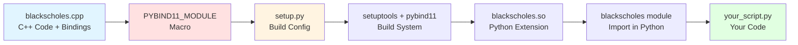

# Black-Scholes pybind11 Integration (Example 2 of 3)

This example demonstrates how to integrate C++ code with Python using [pybind11](https://github.com/pybind/pybind11). It wraps a Black-Scholes option pricing implementation in C++ so it can be called from Python code.

## What This Example Shows

- How to use pybind11 to create Python bindings for C++ functions
- Building Python wheels with C++ extensions
- Calling C++ functions from Python with native performance
- Using setuptools for packaging

## Learning Path

This is **Part 2 of 3** in the C++ integration examples:
1. [01-blackscholes-javacpp](../01-blackscholes-javacpp/) - Learn JavaCPP basics
2. **02-blackscholes-pybind11** (this example) - Learn pybind11 basics
3. [03-blackscholes-combined](../03-blackscholes-combined/) - See both working together in Deephaven

## About the Implementation

The core Black-Scholes C++ implementation is located in [../shared/blackscholes](../shared/blackscholes/). This example wraps it for use in Python.

### How pybind11 Works



The pybind11 workflow:
1. Write C++ code with `PYBIND11_MODULE` macro to define bindings
2. Create `setup.py` with `Pybind11Extension`
3. Build system compiles C++ into a Python extension module
4. Install the wheel file with pip
5. Import and use from Python with natural syntax

## Resources

For more details on pybind11:
- [pybind11 GitHub](https://github.com/pybind/pybind11)
- [pybind11 Documentation](https://pybind11.readthedocs.io/)

## Building

To build this example, you will need to have the following installed:
* Python
* A C++ compiler

To build a wheel file, run the following command:
```bash
./build.sh
```

The build script automatically tests the wheel at the end. You should see output like:
```
BlackScholes Price: 13.270...
```

## Running

The build creates a wheel file in the `dist/` directory that can be installed with pip:
```bash
pip install dist/blackscholes-*.whl
```

Then use it in Python:
```python
import blackscholes
price = blackscholes.price(100, 95, 0.05, 0.6, 0.4, True, False)
print(f"Price: {price}")
```

## Next Steps

After completing this example, continue to:
- [03-blackscholes-combined](../03-blackscholes-combined/) - See both JavaCPP and pybind11 working together in Deephaven

Or go back to:
- [01-blackscholes-javacpp](../01-blackscholes-javacpp/) - Review the JavaCPP integration

