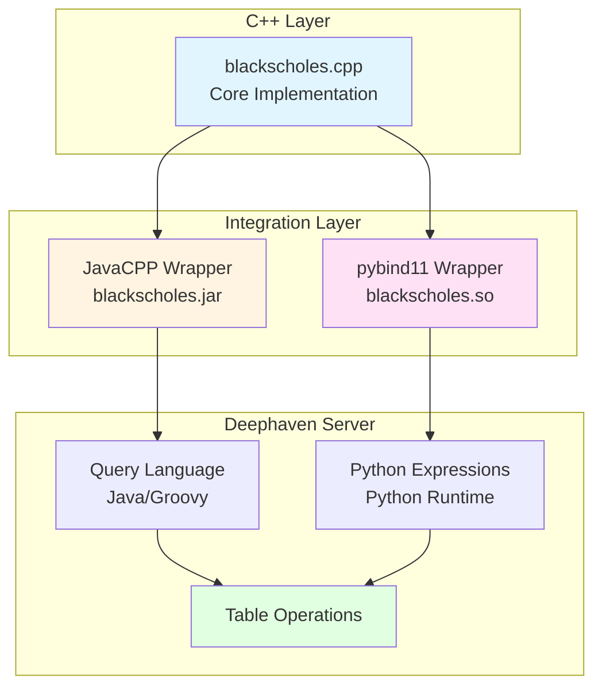

# Black-Scholes Combined Integration (Example 3 of 3)

This example demonstrates both JavaCPP and pybind11 C++ integrations working together in a Deephaven server. It shows how you can use C++ code from both Java (in Deephaven queries) and Python (in Python expressions) simultaneously.

## What This Example Shows

- Running a Deephaven server with C++ integrations
- Using JavaCPP-wrapped C++ functions in Deephaven query language
- Using pybind11-wrapped C++ functions in Python expressions
- Comparing both approaches side-by-side
- Docker deployment of the complete stack

## Learning Path

This is **Part 3 of 3** in the C++ integration examples:
1. [01-blackscholes-javacpp](../01-blackscholes-javacpp/) - Learn JavaCPP basics
2. [02-blackscholes-pybind11](../02-blackscholes-pybind11/) - Learn pybind11 basics
3. **03-blackscholes-combined** (this example) - See both working together in Deephaven

## Prerequisites

- Java (JDK 17 or later)
- Python 3.12
- A C++ compiler (g++ or clang)

## Building Locally

The build script will compile both integrations and set up a Python virtual environment:

```bash
./scripts/build_all.sh
```

This will:
1. Build the pybind11 integration from `../02-blackscholes-pybind11/`
2. Build the JavaCPP integration from `../01-blackscholes-javacpp/`
3. Create a virtual environment with Deephaven server
4. Install both integrations into the environment

## Running Locally

After building, start the Deephaven server:

```bash
source venv/bin/activate
deephaven server --extra-classpath "./venv/example/blackscholes.jar ./venv/example/javacpp.jar" --jvm-args "-Djava.library.path=./venv/example -DAuthHandlers=io.deephaven.auth.AnonymousAuthenticationHandler"
```

Then open your browser to `http://localhost:10000`

When done, deactivate the virtual environment:
```bash
deactivate
```

## How It Works

This example combines both integration methods in a single Deephaven server:



Both wrappers provide access to the same C++ functions, allowing you to choose the best approach for each use case.

## Example Queries

### Basic Usage (pybind11 only)

See [examples/basic_usage.py](./examples/basic_usage.py):

```python
from deephaven import empty_table
import blackscholes

t = empty_table(10).update([
    "UnderlyingPrice = 100 + i",
    "Strike = 95",
    "Price = (double) blackscholes.price(UnderlyingPrice, Strike, 0.05, 0.6, 0.4, true, false)",
])
```

### Side-by-Side Comparison

See [examples/side_by_side.py](./examples/side_by_side.py):

```python
from deephaven import empty_table
import blackscholes

t = empty_table(10).update([
    "UnderlyingPrice = 100 + i",
    "Strike = 95",
    "RiskFree = 0.05",
    "YearsToExpiry = 0.6",
    "Vol = 0.4",
    "IsCall = true",
    "IsStock = false",
    # Python/C++ via pybind11
    "PythonCppPrice = (double) blackscholes.price(UnderlyingPrice, Strike, RiskFree, YearsToExpiry, Vol, IsCall, IsStock)",
    # Java/C++ via JavaCPP
    "JavaCppPrice = io.deephaven.BlackScholes.price(UnderlyingPrice, Strike, RiskFree, YearsToExpiry, Vol, IsCall, IsStock)",
])
```

Both columns should show identical results, demonstrating that both integration methods work correctly!

## Docker Deployment

Build the Docker image:

```bash
cd docker
./build_docker.sh
```

Run the container:

```bash
docker run -it --rm -p 10000:10000 deephaven-blackscholes:latest
```

Or start a bash shell to explore:

```bash
docker run -it --rm -p 10000:10000 deephaven-blackscholes:latest bash
```

## Project Structure

```
03-blackscholes-combined/
├── README.md                    # This file
├── docker/
│   ├── Dockerfile               # Docker image definition
│   └── build_docker.sh          # Docker build script
├── scripts/
│   └── build_all.sh             # Builds both integrations
├── examples/
│   ├── basic_usage.py           # Simple example
│   └── side_by_side.py          # Compare both approaches
└── requirements.txt             # Python dependencies
```

## Next Steps

- Explore the [shared/blackscholes](../shared/blackscholes/) core implementation
- Review [01-blackscholes-javacpp](../01-blackscholes-javacpp/) for JavaCPP details
- Review [02-blackscholes-pybind11](../02-blackscholes-pybind11/) for pybind11 details
- Adapt this pattern for your own C++ code!