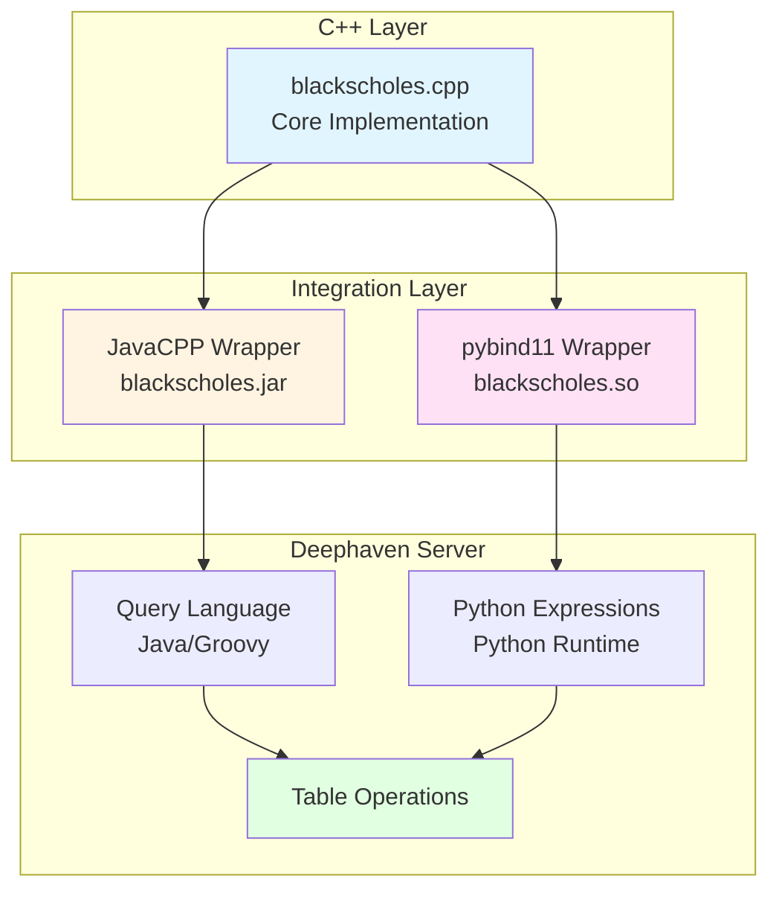

# Black-Scholes Combined Integration (Example 3 of 3)

This example demonstrates both JavaCPP and pybind11 C++ integrations working together in a Deephaven server. It shows how you can use C++ code from both Java (in Deephaven queries) and Python (in Python expressions) simultaneously.

## What This Example Shows

- Running a Deephaven server with C++ integrations
- Using JavaCPP-wrapped C++ functions in Deephaven query language
- Using pybind11-wrapped C++ functions in Python expressions
- Comparing both approaches side-by-side
- Docker deployment of the complete stack

## Learning Path

This is **Part 3 of 3** in the C++ integration examples:
1. [01-blackscholes-javacpp](../01-blackscholes-javacpp/) - Learn JavaCPP basics
2. [02-blackscholes-pybind11](../02-blackscholes-pybind11/) - Learn pybind11 basics
3. **03-blackscholes-combined** (this example) - See both working together in Deephaven

## Prerequisites

- Java (JDK 17 or later)
- Python 3.12 or later (configurable via `PYTHON` environment variable)
- A C++ compiler (g++ or clang)

## Building Locally

The build script will compile both integrations and set up a Python virtual environment:

```bash
./build.sh
```

This will:
1. Build the pybind11 integration from `../02-blackscholes-pybind11/`
2. Build the JavaCPP integration from `../01-blackscholes-javacpp/`
3. Create a virtual environment with Deephaven server
4. Install both integrations into the environment

## Running Locally

After building, start the Deephaven server:

```bash
source venv/bin/activate
deephaven server --extra-classpath "./venv/example/blackscholes.jar ./venv/example/javacpp.jar" --jvm-args "-Djava.library.path=./venv/example -DAuthHandlers=io.deephaven.auth.AnonymousAuthenticationHandler"
```

Then open your browser to `http://localhost:10000`

When done, deactivate the virtual environment:
```bash
deactivate
```

## How It Works

This example combines both integration methods in a single Deephaven server:



Both wrappers provide access to the same C++ functions, allowing you to choose the best approach for each use case.

## Example Queries

### Real-Time Options Pricing

See [examples/options_pricing.py](./examples/options_pricing.py) for a comprehensive example with:
- Real-time ticking data (updates every second)
- Multiple stocks (AAPL, AMZN, GOOG, MSFT, ORCL)
- All Greeks (Price, Delta, Gamma, Theta, Vega, Rho)
- Side-by-side comparison of pybind11 and JavaCPP

```python
from deephaven import time_table
import deephaven.dtypes as dht
import blackscholes

# Define the stock symbols and their seed prices
syms = dht.array(dht.string, ["AAPL", "AMZN", "GOOG", "MSFT", "ORCL"])
seed_prices = dht.array(dht.double, [268.0, 255.0, 282.0, 520.0, 258.0])

# Create a real-time ticking table that updates every second
t = time_table("PT1S").update([
    # Cycle through stock symbols
    "SymbolIndex = (int)(ii % syms.length)",
    "Symbol = syms[SymbolIndex]",
    "SeedPrice = seed_prices[SymbolIndex]",
    
    # Add random variation around seed price (gaussian distribution with ~2-3% std deviation)
    "UnderlyingPrice = SeedPrice + randomGaussian(0.0, SeedPrice * 0.025)",
    
    # Create strike prices in $5 intervals around the seed price
    # Randomly select a strike between -25 and +25 from seed (in $5 increments)
    "StrikeOffset = ((int)randomDouble(-5, 6)) * 5",  # -25 to +25 in $5 increments
    "Strike = ((int)(SeedPrice / 5)) * 5 + StrikeOffset",  # Round seed to nearest $5 then add offset
    
    "RiskFree = 0.05",
    "YearsToExpiry = 0.6",
    "Vol = 0.3 + (SymbolIndex % syms.length) * 0.02",
    "IsCall = randomBool()",  # 50% calls, 50% puts
    "IsStock = randomDouble(0.0, 1.0) < 0.2",  # 20% stock positions
    
    # pybind11 integration - all Greeks
    "PricePybind11 = (double) blackscholes.price(UnderlyingPrice, Strike, RiskFree, YearsToExpiry, Vol, IsCall, IsStock)",
    "DeltaPybind11 = (double) blackscholes.delta(UnderlyingPrice, Strike, RiskFree, YearsToExpiry, Vol, IsCall, IsStock)",
    "GammaPybind11 = (double) blackscholes.gamma(UnderlyingPrice, Strike, RiskFree, YearsToExpiry, Vol, IsStock)",
    "ThetaPybind11 = (double) blackscholes.theta(UnderlyingPrice, Strike, RiskFree, YearsToExpiry, Vol, IsCall, IsStock)",
    "VegaPybind11 = (double) blackscholes.vega(UnderlyingPrice, Strike, RiskFree, YearsToExpiry, Vol, IsStock)",
    "RhoPybind11 = (double) blackscholes.rho(UnderlyingPrice, Strike, RiskFree, YearsToExpiry, Vol, IsCall, IsStock)",
    
    # JavaCPP integration - all Greeks  
    "PriceJavaCpp = io.deephaven.BlackScholes.price(UnderlyingPrice, Strike, RiskFree, YearsToExpiry, Vol, IsCall, IsStock)",
    "DeltaJavaCpp = io.deephaven.BlackScholes.delta(UnderlyingPrice, Strike, RiskFree, YearsToExpiry, Vol, IsCall, IsStock)",
    "GammaJavaCpp = io.deephaven.BlackScholes.gamma(UnderlyingPrice, Strike, RiskFree, YearsToExpiry, Vol, IsStock)",
    "ThetaJavaCpp = io.deephaven.BlackScholes.theta(UnderlyingPrice, Strike, RiskFree, YearsToExpiry, Vol, IsCall, IsStock)",
    "VegaJavaCpp = io.deephaven.BlackScholes.vega(UnderlyingPrice, Strike, RiskFree, YearsToExpiry, Vol, IsStock)",
    "RhoJavaCpp = io.deephaven.BlackScholes.rho(UnderlyingPrice, Strike, RiskFree, YearsToExpiry, Vol, IsCall, IsStock)",
])\
.reverse()\
.move_columns_up(["Timestamp", "Symbol", "UnderlyingPrice", "Strike", "Vol", "IsCall", "PricePybind11", "PriceJavaCpp", "DeltaPybind11", "DeltaJavaCpp"])
```

Both integrations produce identical results, demonstrating that both methods correctly call the same underlying C++ code!

## Docker Deployment

The easiest way to run this example is with Docker Compose:

```bash
docker compose up
```

This will build the image and start the Deephaven server. Access it at http://localhost:10000

After making code changes, rebuild and restart:
```bash
docker compose up --build
```

To run in the background:
```bash
docker compose up -d
```

To stop:
```bash
docker compose down
```

To start a bash shell for debugging:
```bash
docker compose run --rm deephaven-blackscholes bash
```

## Project Structure

```
03-blackscholes-combined/
├── README.md                    # This file
├── build.sh                     # Builds both integrations
├── Dockerfile                   # Docker image definition
├── docker-compose.yml           # Docker Compose configuration
└── examples/
    └── options_pricing.py       # Real-time options pricing with multiple stocks
```

## Next Steps

- Explore the [shared/blackscholes](../shared/blackscholes/) core implementation
- Review [01-blackscholes-javacpp](../01-blackscholes-javacpp/) for JavaCPP details
- Review [02-blackscholes-pybind11](../02-blackscholes-pybind11/) for pybind11 details
- Adapt this pattern for your own C++ code!
