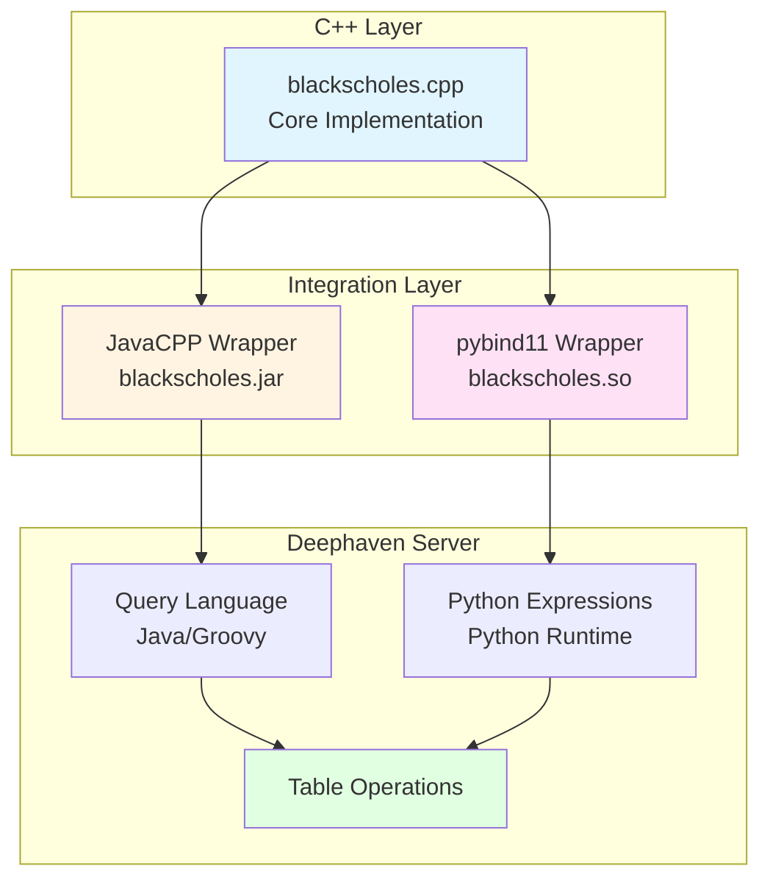

# Black-Scholes Combined Integration (Example 3 of 3)

This example demonstrates both JavaCPP and pybind11 C++ integrations working together in a Deephaven server. It shows how you can use C++ code from both Java (in Deephaven queries) and Python (in Python expressions) simultaneously.

## What This Example Shows

- Running a Deephaven server with C++ integrations
- Using JavaCPP-wrapped C++ functions in Deephaven query language
- Using pybind11-wrapped C++ functions in Python expressions
- Comparing both approaches side-by-side
- Docker deployment of the complete stack

## Learning Path

This is **Part 3 of 3** in the C++ integration examples:
1. [01-blackscholes-javacpp](../01-blackscholes-javacpp/) - Learn JavaCPP basics
2. [02-blackscholes-pybind11](../02-blackscholes-pybind11/) - Learn pybind11 basics
3. **03-blackscholes-combined** (this example) - See both working together in Deephaven

## Prerequisites

- Java (JDK 17 or later)
- Python 3.12 or later (configurable via `PYTHON` environment variable)
- A C++ compiler (g++ or clang)

## Building Locally

The build script will compile both integrations and set up a Python virtual environment:

```bash
./build.sh
```

This will:
1. Build the pybind11 integration from `../02-blackscholes-pybind11/`
2. Build the JavaCPP integration from `../01-blackscholes-javacpp/`
3. Create a virtual environment with Deephaven server
4. Install both integrations into the environment

## Running Locally

After building, start the Deephaven server:

```bash
source venv/bin/activate
deephaven server --extra-classpath "./venv/example/blackscholes.jar ./venv/example/javacpp.jar" --jvm-args "-Djava.library.path=./venv/example -DAuthHandlers=io.deephaven.auth.AnonymousAuthenticationHandler"
```

Then open your browser to `http://localhost:10000`

When done, deactivate the virtual environment:
```bash
deactivate
```

## How It Works

This example combines both integration methods in a single Deephaven server:



Both wrappers provide access to the same C++ functions, allowing you to choose the best approach for each use case.

## Example Queries

### Real-Time Options Pricing

See [examples/options_pricing.py](./examples/options_pricing.py) for a comprehensive example with:
- Real-time ticking data (updates every second)
- Multiple stocks (AAPL, AMZN, GOOG, MSFT, ORCL)
- All Greeks (Price, Delta, Gamma, Theta, Vega, Rho)
- Side-by-side comparison of pybind11 and JavaCPP

```python
from deephaven import time_table
import blackscholes

t = time_table("PT1S").update([
    "Symbol = syms[ (int)(ii % syms.length) ]",
    "UnderlyingPrice = 100 + (ii % 50) + Math.sin(ii * 0.1) * 10",
    "Strike = 95",
    # ... other parameters ...
    
    # pybind11 integration - all Greeks
    "PricePybind11 = (double) blackscholes.price(...)",
    "DeltaPybind11 = (double) blackscholes.delta(...)",
    # ... other Greeks ...
    
    # JavaCPP integration - all Greeks  
    "PriceJavaCpp = io.deephaven.BlackScholes.price(...)",
    "DeltaJavaCpp = io.deephaven.BlackScholes.delta(...)",
    # ... other Greeks ...
])
```

Both integrations produce identical results, demonstrating that both methods correctly call the same underlying C++ code!

## Docker Deployment

The easiest way to run this example is with Docker Compose:

```bash
docker compose up
```

This will build the image and start the Deephaven server. Access it at http://localhost:10000

After making code changes, rebuild and restart:
```bash
docker compose up --build
```

To run in the background:
```bash
docker compose up -d
```

To stop:
```bash
docker compose down
```

To start a bash shell for debugging:
```bash
docker compose run --rm deephaven-blackscholes bash
```

## Project Structure

```
03-blackscholes-combined/
├── README.md                    # This file
├── build.sh                     # Builds both integrations
├── Dockerfile                   # Docker image definition
├── docker-compose.yml           # Docker Compose configuration
└── examples/
    └── options_pricing.py       # Real-time options pricing with multiple stocks
```

## Next Steps

- Explore the [shared/blackscholes](../shared/blackscholes/) core implementation
- Review [01-blackscholes-javacpp](../01-blackscholes-javacpp/) for JavaCPP details
- Review [02-blackscholes-pybind11](../02-blackscholes-pybind11/) for pybind11 details
- Adapt this pattern for your own C++ code!