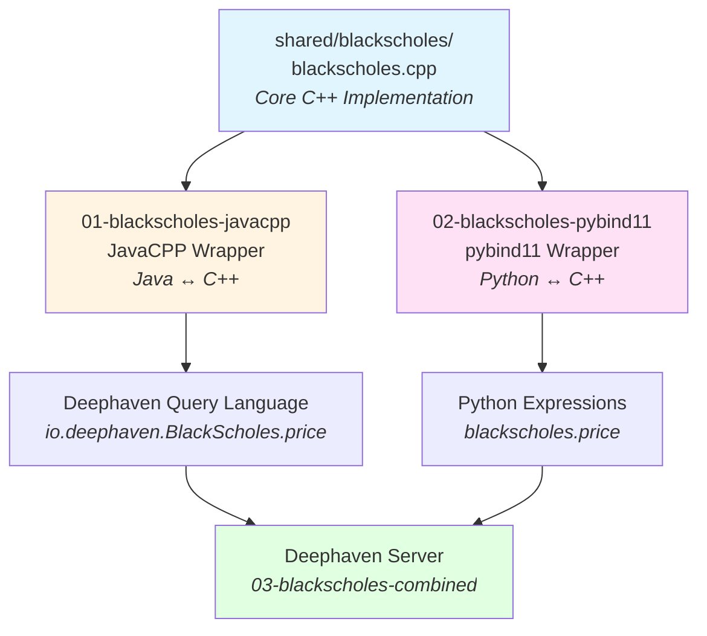

# C++ Integration Examples

Learn how to integrate high-performance C++ code with Deephaven for real-time data processing.

## Overview

These examples demonstrate how to wrap C++ code so it can be called from both Deephaven's query language (Java) and Python expressions. Using the Black-Scholes option pricing model as a practical example, you'll learn two integration approaches:

1. **JavaCPP** - Call C++ functions directly in Deephaven queries
2. **pybind11** - Call C++ functions in Python scripts and expressions

**Why integrate C++ with Deephaven?**
- **Performance**: Native C++ speed for computationally intensive operations
- **Reuse**: Leverage existing C++ libraries and codebases
- **Flexibility**: Choose Java or Python integration based on your needs
- **Real-time**: Process streaming data with native code performance

## Structure

### Shared Code
- **[shared/blackscholes](./shared/blackscholes/)** - Core Black-Scholes implementation in C++

### Examples (in recommended learning order)

#### 1. [01-blackscholes-javacpp](./01-blackscholes-javacpp/) - JavaCPP Integration
Wrap C++ code for use in Deephaven's query language (Java/Groovy).

**What you'll learn:**
- Using JavaCPP to create Java bindings for C++ functions
- Building and packaging C++ code as JAR files
- Calling C++ from Deephaven queries with `io.deephaven.BlackScholes.price(...)`

**Best for:** Using C++ in table operations and query expressions

#### 2. [02-blackscholes-pybind11](./02-blackscholes-pybind11/) - pybind11 Integration
Wrap C++ code for use in Python scripts and expressions.

**What you'll learn:**
- Using pybind11 to create Python bindings for C++ functions
- Building Python wheels with C++ extensions
- Calling C++ from Python with `blackscholes.price(...)`

**Best for:** Using C++ in Python scripts, notebooks, and Python expressions

#### 3. [03-blackscholes-combined](./03-blackscholes-combined/) - Complete Example
See both integrations working together in a live Deephaven server.

**What you'll learn:**
- Running Deephaven with both C++ integrations
- Real-time options pricing with multiple stocks
- Side-by-side comparison of both approaches
- Docker deployment

**Best for:** Understanding the complete picture and seeing real-world usage

## Quick Start

### Option 1: Try Individual Examples

```bash
# Test JavaCPP integration (builds and runs a simple test)
cd 01-blackscholes-javacpp
./build.sh

# Test pybind11 integration (builds and runs a simple test)
cd ../02-blackscholes-pybind11
./build.sh
```

### Option 2: Run Complete Deephaven Example

```bash
# Build both integrations and start Deephaven server
cd 03-blackscholes-combined
./build.sh
source venv/bin/activate

# Start Deephaven with C++ integrations loaded
deephaven server \
  --extra-classpath "./venv/example/blackscholes.jar ./venv/example/javacpp.jar" \
  --jvm-args "-Djava.library.path=./venv/example -DAuthHandlers=io.deephaven.auth.AnonymousAuthenticationHandler"

# Open http://localhost:10000 in your browser
# Then copy the contents of `examples/options_pricing.py` and paste it into the console to run it.
```

### Option 3: Use Docker (Easiest)

```bash
cd 03-blackscholes-combined
docker compose up

# Open http://localhost:10000 in your browser
# The example script is already loaded
```

## What the Example Does

The examples implement **Black-Scholes option pricing** - a mathematical model for calculating the theoretical price of financial options. The C++ implementation calculates:

- **Option Price** - Fair value of call/put options
- **Greeks** - Risk metrics (Delta, Gamma, Theta, Vega, Rho)

The combined example demonstrates **real-time options pricing** for multiple stocks (AAPL, AMZN, GOOG, MSFT, ORCL) with data updating every second, showing both C++ integration methods producing identical results side-by-side.

## Architecture



## What You'll Learn

- **C++ Integration Patterns**: Two different approaches to wrapping C++ code
- **Build Systems**: How to compile and package C++ extensions
- **Deephaven Integration**: Using C++ functions in Deephaven queries
- **Performance**: Native C++ performance in data processing pipelines
- **Docker Deployment**: Containerizing C++ integrations

## Prerequisites

- Java (JDK 17 or later)
- Python 3.12 or later (configurable via `PYTHON` environment variable)
- A C++ compiler (g++, clang, or MSVC)
- Docker (optional, for containerized deployment)

## Use Cases

These examples are useful if you:
- Have existing C++ libraries you want to use in Deephaven
- Need high-performance computations in your data pipelines
- Want to leverage C++ numerical libraries (e.g., Eigen, Boost)
- Are building custom analytics that require native code performance

## Next Steps

1. Start with [01-blackscholes-javacpp](./01-blackscholes-javacpp/) to learn JavaCPP basics
2. Continue to [02-blackscholes-pybind11](./02-blackscholes-pybind11/) to learn pybind11 basics
3. Finish with [03-blackscholes-combined](./03-blackscholes-combined/) to see both working together
4. Adapt these patterns for your own C++ code!
