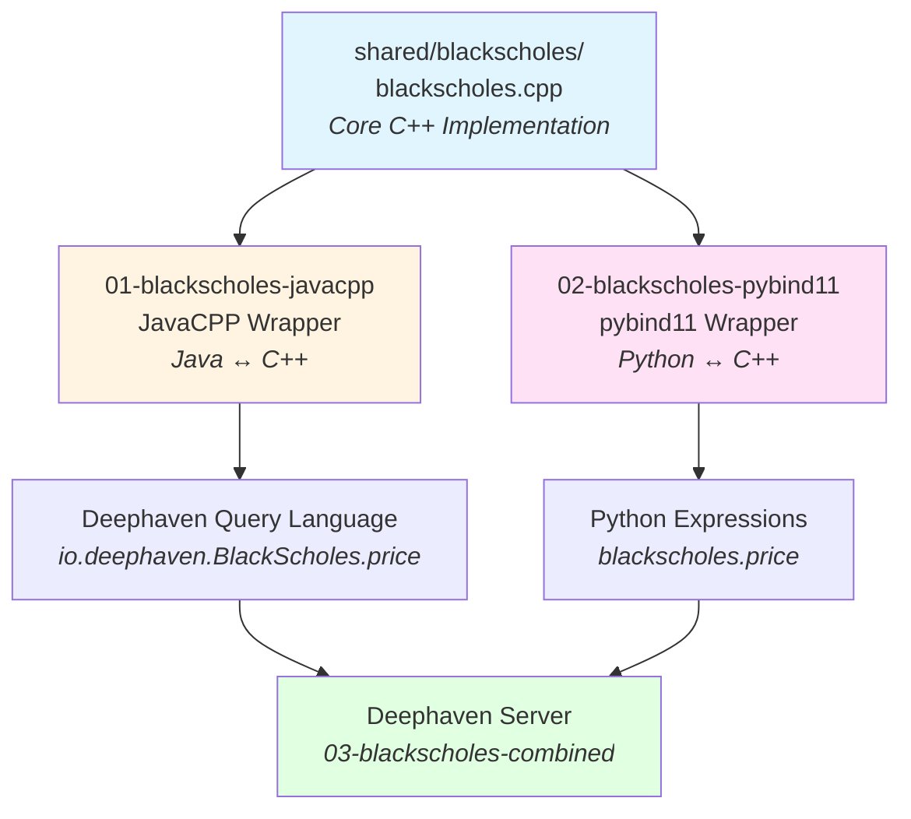

# C++ Integration Examples

This directory contains examples of integrating C++ code with Deephaven using different approaches. The examples demonstrate Black-Scholes option pricing calculations implemented in C++ and made available through both Java and Python.

## Structure

### Shared Code
- **[shared/blackscholes](./shared/blackscholes/)** - Core Black-Scholes implementation in C++

### Examples (in recommended learning order)

#### 1. [01-blackscholes-javacpp](./01-blackscholes-javacpp/)
Learn how to integrate C++ code with Java using JavaCPP. This example shows:
- Wrapping C++ functions for use in Java
- Building and packaging with JavaCPP
- Calling C++ from Java code

**Start here** if you want to use C++ in Deephaven's query language.

#### 2. [02-blackscholes-pybind11](./02-blackscholes-pybind11/)
Learn how to integrate C++ code with Python using pybind11. This example shows:
- Creating Python bindings for C++ functions
- Building Python wheels with C++ extensions
- Calling C++ from Python code

**Start here** if you want to use C++ in Python scripts that interact with Deephaven.

#### 3. [03-blackscholes-combined](./03-blackscholes-combined/)
See both integration methods working together in a running Deephaven server. This example shows:
- Using JavaCPP-wrapped C++ in Deephaven queries
- Using pybind11-wrapped C++ in Python expressions
- Comparing performance and usage patterns
- Docker deployment

**Start here** if you want to see the complete picture.

## Quick Start

```bash
# Build and test JavaCPP integration
cd 01-blackscholes-javacpp
./build.sh

# Build and test pybind11 integration
cd ../02-blackscholes-pybind11
./build.sh

# Run combined example with Deephaven
cd ../03-blackscholes-combined
./scripts/build_all.sh
source venv/bin/activate
deephaven server --extra-classpath "./venv/example/blackscholes.jar ./venv/example/javacpp.jar" --jvm-args "-Djava.library.path=./venv/example -DAuthHandlers=io.deephaven.auth.AnonymousAuthenticationHandler"

# Or use Docker
cd docker
./build_docker.sh
docker run -it --rm -p 10000:10000 deephaven-blackscholes:latest
```

## Architecture



## What You'll Learn

- **C++ Integration Patterns**: Two different approaches to wrapping C++ code
- **Build Systems**: How to compile and package C++ extensions
- **Deephaven Integration**: Using C++ functions in Deephaven queries
- **Performance**: Native C++ performance in data processing pipelines
- **Docker Deployment**: Containerizing C++ integrations

## Prerequisites

- Java (JDK 17 or later)
- Python 3.12
- A C++ compiler (g++, clang, or MSVC)
- Docker (optional, for containerized deployment)

## Use Cases

These examples are useful if you:
- Have existing C++ libraries you want to use in Deephaven
- Need high-performance computations in your data pipelines
- Want to leverage C++ numerical libraries (e.g., Eigen, Boost)
- Are building custom analytics that require native code performance

## Next Steps

1. Start with [01-blackscholes-javacpp](./01-blackscholes-javacpp/) to learn JavaCPP basics
2. Continue to [02-blackscholes-pybind11](./02-blackscholes-pybind11/) to learn pybind11 basics
3. Finish with [03-blackscholes-combined](./03-blackscholes-combined/) to see both working together
4. Adapt these patterns for your own C++ code!
